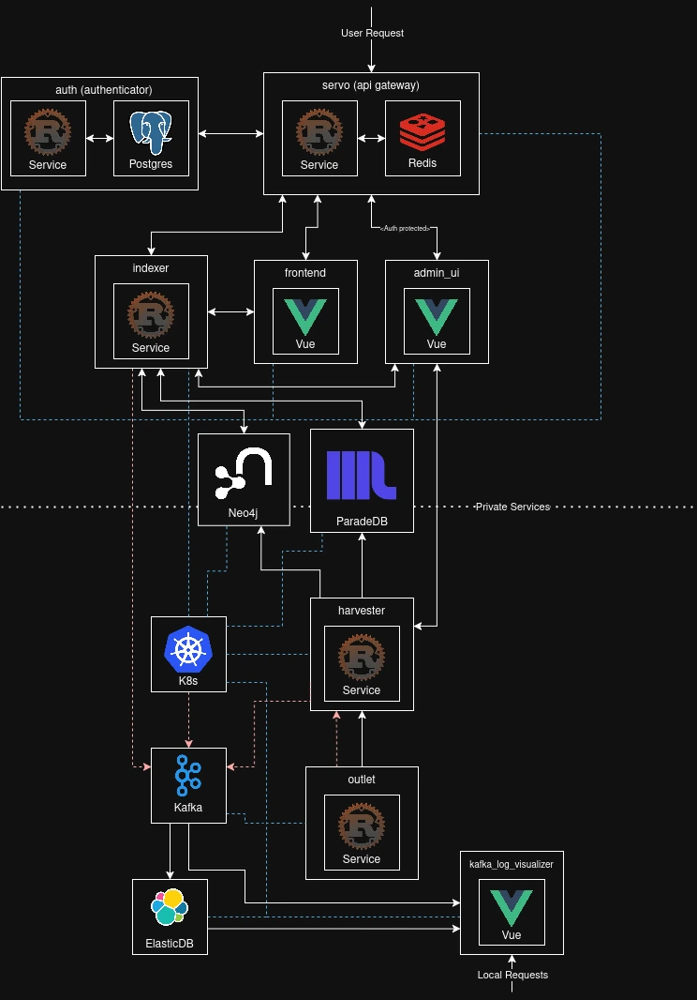

# Oxalate
A comprehensive web search engine and full-stack data pipeline.

# Development
To get started, install Nix and enable Flakes and nix-command. Then, enter the development shell:
```
nix develop
```

In the /deploy/dev there is a docker compose you need to run to be able to turn on the services
```
docker compose up -d
```

# Deployment
Oxalate uses Nix to ensure reproducible builds. Build and load the images into your Docker daemon with the following commands:
```
docker load < $(nix build .#docker-harvester --print-out-paths)
docker load < $(nix build .#docker-outlet --print-out-paths)
docker load < $(nix build .#docker-indexer --print-out-paths) 
```

Copy the example environment file and update it with your specific settings:
```
cp ./.env.example ./.env
```

Finally, deploy the stack using Docker Compose:
```
docker compose up -d
```



https://github.com/user-attachments/assets/a989e7b6-8463-4d61-a97a-869e3e592349

